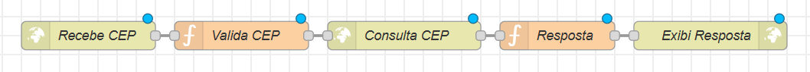

# Relatório Técnico – Consulta de CEP utilizando Node-RED

## 1. Introdução
Este relatório apresenta o desenvolvimento de um sistema de consulta de CEP utilizando a plataforma **Node-RED**. O sistema permite o envio de um CEP por meio de requisições HTTP, utilizando os métodos **GET** ou **POST**, retornando informações de localização referentes ao CEP informado.

## 2. Objetivo
O objetivo do projeto é implementar um serviço web capaz de receber um CEP, realizar a consulta em uma API pública de endereçamento e retornar os dados de **cidade, bairro e estado** em formato JSON.

## 3. Tecnologias Utilizadas
- Node.js  
- Node-RED  
- API ViaCEP  
- Protocolo HTTP (GET e POST)  
- Formato JSON  

## 4. Funcionamento do Sistema
O sistema foi desenvolvido na plataforma **Node-RED**, utilizando os nós **HTTP In**, **Function**, **HTTP Request** e **HTTP Response**. Inicialmente, o CEP é recebido via requisição HTTP. Em seguida, o valor informado é tratado e enviado à API ViaCEP, que retorna os dados correspondentes ao endereço. Após o processamento da resposta, o sistema retorna ao usuário as informações de cidade, bairro e estado.

## 5. Estrutura das Requisições

### Requisição GET

---

## 🖼️ Fluxo do Node-RED

## 🏷️ Nomeação dos Nós

Para facilitar a leitura e manutenção do fluxo, cada nó do Node-RED recebeu uma identificação clara e objetiva:

- **HTTP In:** Recebe CEP
- **Function:** Valida CEP
- **HTTP Request:** Consulta CEP
- **Function:** Resposta
- **HTTP Response:** Exibi Resposta


A figura abaixo apresenta o fluxo desenvolvido no Node-RED para a consulta de CEP.



> **Observação:** a imagem deve ser capturada diretamente no ambiente do Node-RED e salva na raiz do projeto com o nome `fluxo-node-red-consulta-cep.png`.

---

## ⚙️ Estrutura do Fluxo

HTTP In → Function → HTTP Request → Function → HTTP Response


---

## 🔹 Configuração dos Nós

### 1️⃣ HTTP In
- Método: `GET` ou `POST`
- URL: `/cep`

Exemplo de requisição GET:
http://localhost:1880/cep?cep=01001000


---

### 2️⃣ Function – Tratamento do CEP
Responsável por capturar o CEP informado, validar sua existência e remover caracteres inválidos.

```javascript
let cep = msg.req.query.cep || msg.payload.cep;

if (!cep) {
    msg.statusCode = 400;
    msg.payload = { erro: "CEP não informado" };
    return msg;
}

msg.cep = cep.replace(/\D/g, "");
return msg;
3️⃣ HTTP Request – API ViaCEP
Responsável por consultar a API ViaCEP.

Método: GET

URL:

https://viacep.com.br/ws/{{{cep}}}/json/
Retorno: JSON

4️⃣ Function – Formatação da Resposta
Seleciona apenas os dados necessários para o retorno ao cliente.

if (msg.payload.erro) {
    msg.statusCode = 404;
    msg.payload = { erro: "CEP não encontrado" };
    return msg;
}

msg.payload = {
    cidade: msg.payload.localidade,
    bairro: msg.payload.bairro,
    estado: msg.payload.uf
};

return msg;
5️⃣ HTTP Response
Responsável por retornar a resposta final ao cliente.

📥 Estrutura das Requisições
GET
http://localhost:1880/cep?cep=01001000
POST
{
  "cep": "01001000"
}
📤 Estrutura da Resposta
{
  "cidade": "São Paulo",
  "bairro": "Sé",
  "estado": "SP"
}
✅ Conclusão
O sistema desenvolvido atende aos requisitos propostos, permitindo a consulta de CEP via métodos GET e POST, com retorno correto das informações de cidade, bairro e estado. A utilização do Node-RED possibilitou uma implementação simples, organizada e de fácil manutenção.

📚 Referências
https://nodered.org/

https://viacep.com.br/